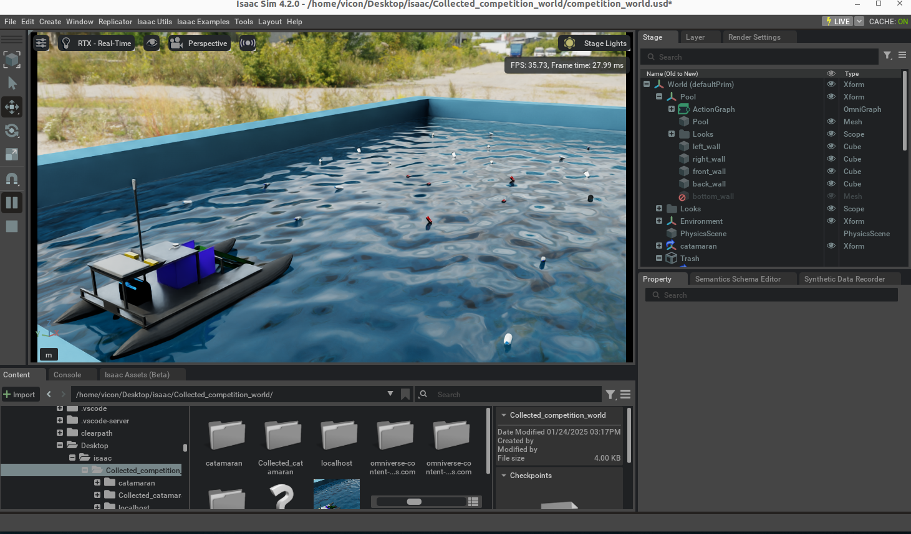
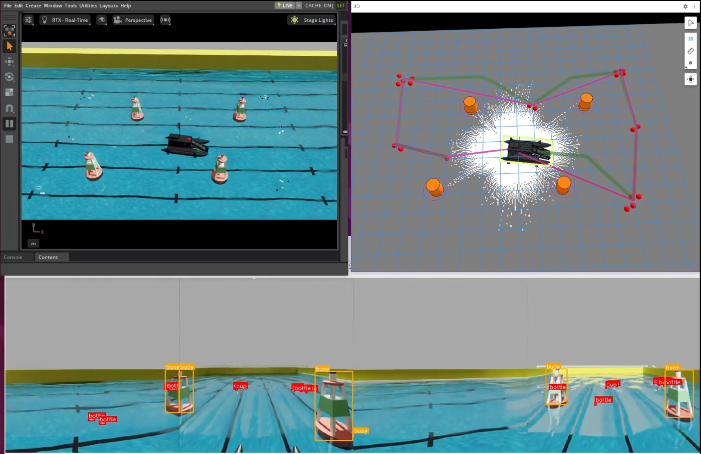

# Atron

This repo contains instructions for how to use the Isaac SIM simulation for the Atron USV autonomous debris collection vehicle.



## Installation

```
mkdir -p ros2_ws/src
cd src
git clone https://github.com/RISC-NYUAD/Triton
cd ../
rosdep install --from-path src --ignore-src -r -y
colcon build --symlink-install && source install/setup.bash
echo "source ~/ros2_ws/install/setup.bash" >> ~/.bashrc
```
## Simulation
### Usage
1. Run the simulation in Isaac Sim using the file in <code>triton_isaac/isaac/Collected_competition_world/competition_world.usd</code>
2. Run the autonomous routine using:

```
ros2 launch triton_bringup simulation.launch.xml
```

3. In another terminal, run
```
ros2 launch triton_navigation op_solver_bridge.launch.py
```

This will launch the planning algorithms, as create a link to the [orienteering solver](https://github.com/gkobeaga/op-solver). 



3. Run the following in another terminal to run the Orienteering -> OMPL -> Pure pursuit navigation pipeline.

```
cd ~/ros2_ws/src/Triton/triton_navigation/config
ros2 service call /export_oplib std_srvs/srv/Trigger
./../../dependencies/op_solver_ros/op-solver/build/src/op-solver opt --op-exact 0 problem.oplib
ros2 service call /create_waypoints std_srvs/srv/Trigger
ros2 service call /generate_path std_srvs/srv/Trigger
ros2 service call /navigate std_srvs/srv/Empty
```

